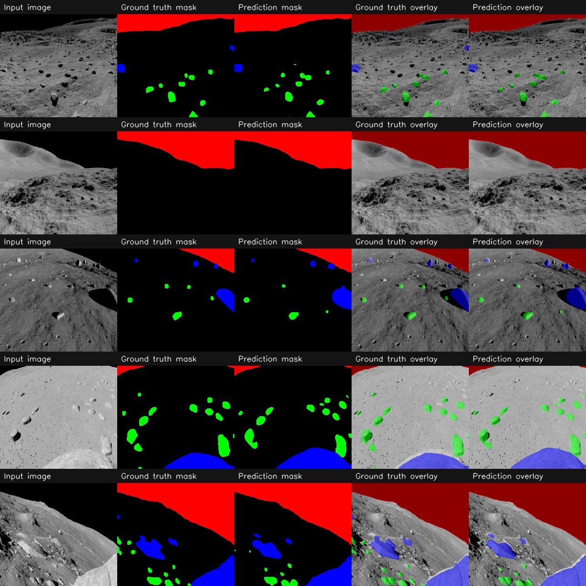

# Moon Rock Segmentation

Projekt semantycznej segmentacji powierzchni Księżyca, którego celem jest pikselowa klasyfikacja obrazu na klasy geologiczne i niebo. Repozytorium zawiera kompletny pipeline: przygotowanie danych, trening, ewaluację i inferencję na danych walidacyjnych oraz realnych zdjęciach.

## Cel Projektu

Model przypisuje każdemu pikselowi jedną z 4 klas:

| ID klasy | Klasa | Opis |
|---|---|---|
| 0 | Background | Regolit / tło |
| 1 | Small Rocks | Drobne skały i odłamki |
| 2 | Large Rocks | Duże skały i głazy |
| 3 | Sky | Niebo / horyzont |

## Dane

- Zbiór: Artificial Lunar Landscape Dataset ([DOI](https://doi.org/10.34740/kaggle/dsv/13263000))
- Wejście: obrazy RGB
- Wyjście: maski segmentacyjne RGB konwertowane do indeksów klas
- Podział: train/val zapisany w pliku manifestu CSV
- Czyszczenie: usuwanie próbek oznaczonych jako anomalne (artefakty renderingu, niedopasowania)

## Metodologia

### Architektura

- Model: Linknet (segmentation-models-pytorch)
- Domyślny enkoder z konfiguracji: ResNet50
- Wejście: 256x256, 3 kanały
- Wyjście: mapa klas 256x256, 4 klasy

### Trening

- Optymalizator: AdamW
- Loss: DiceLoss + CrossEntropyLoss
- Parametry domyślne: patrz configs/base_config.yaml
- Logowanie eksperymentów: Weights & Biases

### Augmentacje

- Resize 256x256
- Horizontal/Vertical Flip
- RandomRotate90
- GaussNoise lub RandomBrightnessContrast
- Normalizacja ImageNet

## Wyniki Wizualne

Poniżej znajduje się przykładowy wynik walidacji z podpisanymi panelami (input, ground truth, prediction, overlay):



## Instalacja

```bash
pip install -r requirements.txt
```

## Uruchomienie

### 1) Trening

```bash
python src/train.py --config configs/base_config.yaml
```

### 2) Ewaluacja metryk

```bash
python src/verify.py
```

### 3) Inferencja na walidacji (generuje validation_results.png)

```bash
python src/inference.py
```

### 4) Inferencja na realnych zdjęciach (generuje real_moon_results.png)

```bash
python src/inference_real.py
```


